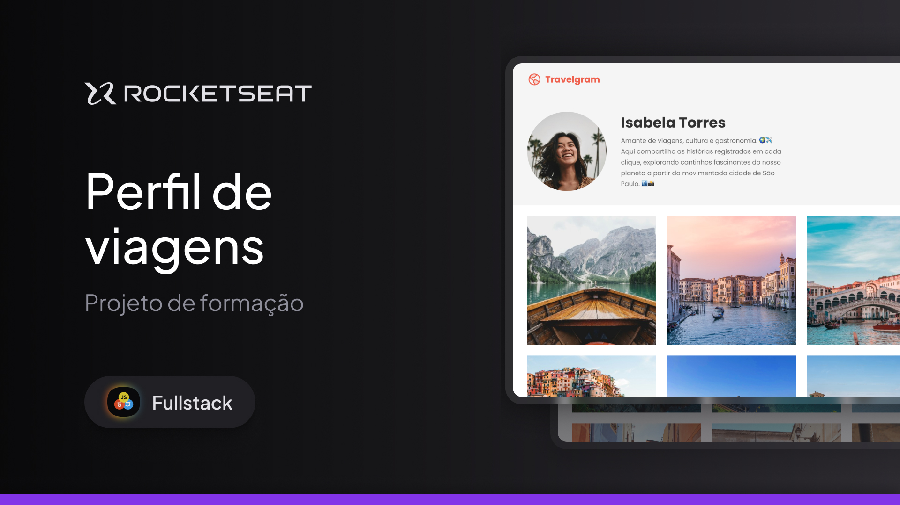

<h1 align="center"> Travelgram | Perfil de viagens </h1>

Desenvolvido em curso promovido pela Rocketseat para ensino de tecnologias WEB.  
<a href="https://app.rocketseat.com.br/classroom/avancando-no-html-e-css-2/group/projeto-travelgram/lesson/apresentando-o-projeto-4">Estude esse projeto em formato de vídeo clicando aqui.</a>

  <a href="#-tecnologias">Tecnologias</a>&nbsp;&nbsp;&nbsp;|&nbsp;&nbsp;&nbsp;
  <a href="#-projeto">Projeto</a>&nbsp;&nbsp;&nbsp;|&nbsp;&nbsp;&nbsp;
  <a href="#-layout">Layout</a>&nbsp;&nbsp;&nbsp;|&nbsp;&nbsp;&nbsp;
  <a href="#memo-licença">Licença</a>

  

 

  

## 🚀 Tecnologias

Esse projeto foi desenvolvido com as seguintes tecnologias:

- HTML e CSS
- Git e Github
- Figma

## 💻 Projeto

Estudo de CSS e HTML.

- [Acesse o projeto finalizado, online](https://github.com/lunavitoria99/Projeto-travelgram/blob/master/index.html)

- [Assistir aulas](https://app.rocketseat.com.br/classroom/avancando-no-html-e-css-2/group/projeto-travelgram/lesson/apresentando-o-projeto-4)

## 🔖 Layout

Você pode visualizar o layout do projeto através [DESSE LINK](https://www.figma.com/design/rRwR1Z9SnbybDyAkAJRzCS/Perfil-de-viagens--Community-?node-id=915-685&t=IHr2LkvFqGkd6fcE-0). É necessário ter conta no [Figma](https://figma.com) para acessá-lo.

## :memo: Licença

Esse projeto está sob a licença MIT.

---

Feito com ♥ by Rocketseat :wave: [Participe da nossa comunidade!](https://discord.gg/rocketseat)